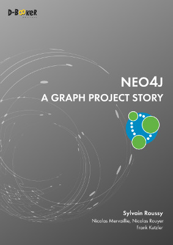
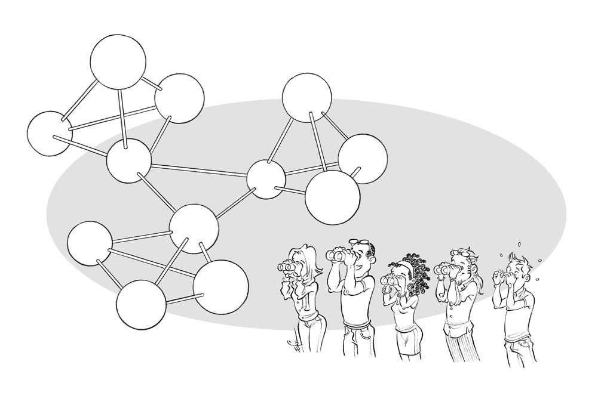

## Neo4j
### A Graph Project Story

You'll find here the source codes of the examples from the book [Neo4j - A Graph Project Story](https://www.d-booker.fr/neo4j2-en/583-neo4j-a-graph-project-story.html), written by Sylvain Roussy, Nicolas Mervaillie, Nicolas Rouyer, and Frank Kutzler (Éditions D-BookeR, May 2019).

This book provides you with a concrete approach of using Neo4j in a production context. Written in the style of a play, it reports the debates between the members of a technical team specialized in strongly connected data. It focuses on methodology, integrations with existing systems, performance, monitoring and security.

[Table Of Content](https://www.d-booker.net/GALERIE/public/neo4j/EN/_neo4j2-graph_project_story-toc.pdf)
[About the Authors](https://www.d-booker.net/GALERIE/public/neo4j/EN/neo4j2-graph_project_story-authors.pdf)
Read an Excerpt: [Welcome to GraphITs.Tech!](https://www.d-booker.net/GALERIE/public/neo4j/EN/_neo4j2-graph_project_story-welcome_to_GraphITs.Tech.pdf)

